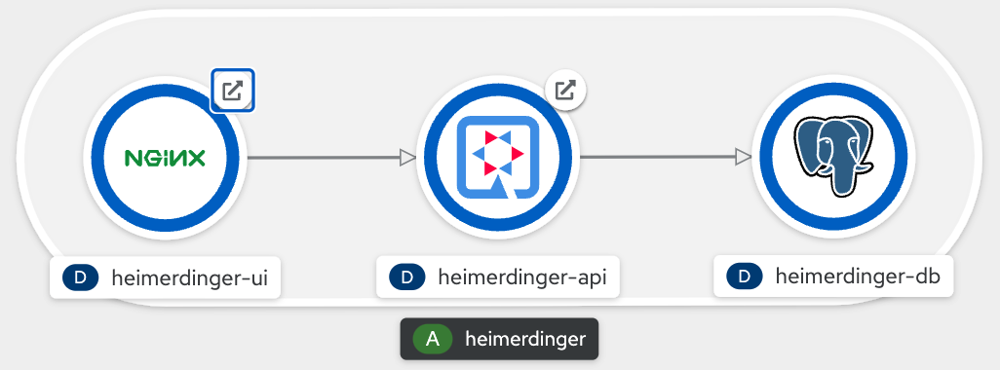

<p align="center">
  
</p>
<h1 align="center">Heimerdinger</h1>

## 1. Overview

Application to monitor and manage servers updates.

Source code repositories:

- [Api](https://github.com/clbartolome/heimerdinger-api)
- [Web UI](https://github.com/clbartolome/heimerdinger-ui)

Follow steps detailed in `section 2.` to deploy this application in OpenShift.

Execute `load_data.sh` script to add some examples in the database. 

Usefull links (On API service, not in the UI!):

- OpenApi: `q/openapi`
- Swagger UI: `q/swagger-ui`

## 2. Openshift Deployment

Follow bellow steps to deploy this services:



Create a namespace for heimerdinger services:

```sh
oc new-project heimerdinger
```

### 2.1. PostgreSQL

Create database:

```sh
oc apply -k deploy/postgresql/base -n heimerdinger
```

Credentials:

- user: **heimer**
- password: **pass**

### 2.2. API

Create image:

```sh
# Create and start build
oc new-build --name=heimerdinger-api ubi8-openjdk-11:1.3~https://github.com/clbartolome/heimerdinger-api -n heimerdinger

# Deploy and follow logs until image is created
oc logs bc/heimerdinger-api -f -n heimerdinger
```

Deploy API:

```sh
oc apply -k deploy/api/base -n heimerdinger
```

Login Credentials:
- user: **heimerdinger**
- pass: **magic**

### 2.3. UI

Create image:

```sh
# Create and start build
oc new-build --name=heimerdinger-ui --strategy=docker https://github.com/clbartolome/heimerdinger-ui -n heimerdinger

# Deploy and follow logs until image is created
oc logs bc/heimerdinger-ui -f -n heimerdinger
```

Configure API connection:

```sh
# Get API url
API_URL=$(oc get route heimerdinger-api -o jsonpath='{.status.ingress[0].host}' -n heimerdinger)

# Create configuration map
cat << EOF | oc apply -n heimerdinger -f -
apiVersion: v1
kind: ConfigMap
metadata:
  name: heimerdinger-ui-config
data:
  config.json: |
    {
      "apiUrl": "http://$API_URL",
      "server": "/servers"
    }
EOF
```

Deploy UI:

```sh
# Deploy applications
oc apply -k deploy/ui/base -n heimerdinger
```


